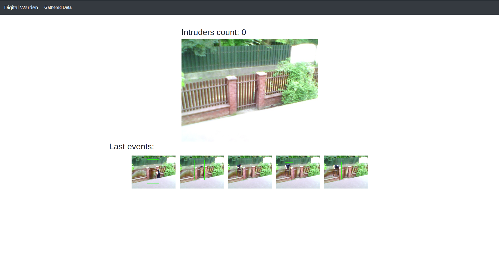
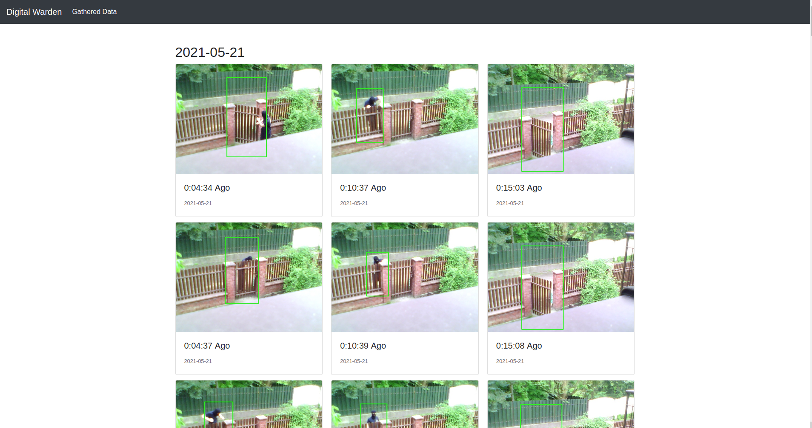

# Digital Warden
Intelligent monitoring featuring live camera preview and registration of people ocuring within device's capturing area.

https://user-images.githubusercontent.com/28395696/119166071-7d7d7c00-ba5e-11eb-869e-5eb5ea11f534.mp4

## Worklog
  * *1st* meeting:
    * Connection with camera
    * Basic people detection
  * *2nd* meeting: 
    * UI structure
    * Intruders count
  * *3rd* meeting:
    * Code refactor
    * Frame storage
    * Real time data transfer
  * *4th* meeting:
    * Raspberry Pi deployment
    * Frame capturing date
    * Code refactor
## Technical aspects
### Environment
List of devices used in constructing a product:
  * Raspberry Pi 4 Model B 4GB RAM
  * USB Webcam

Device has a Raspberry Pi OS installed with python3 and other project's dependencies that are as follows:
  * OpenCV - image processing
  * Flask  - web application framework
  * Socket.io - realtime communication between client and server

### Project structure
Codebase is split into several modules:

#### app.py
Application entry point. Starts aplication, initializes other modules, defines routes and provides context for jinja's templates.

#### camera.py 
Captures frames from camera, saves them to database and sends to the client in realtime.

#### detection.py
Detects people on frame, draws rectangles around them and counts them.

#### helpers.py
Provides functions to parse frame's metadata to be more suited for display in template.

#### storage.py
Exposes API for initializig, saving, reading and closing sqlite database.

## User manual
### Installation
  * Connect device with camera via USB.
  * Connect the device with network via ethernet cable.
  * Plug the device in.

From now on the application is accesible from your local network at digitalwarden.local:5000. The application consists of two views:
  * Main panel - Image from camera and preview of most recent events.

  * Saved events - All events that were registered in the past with occurence date.
